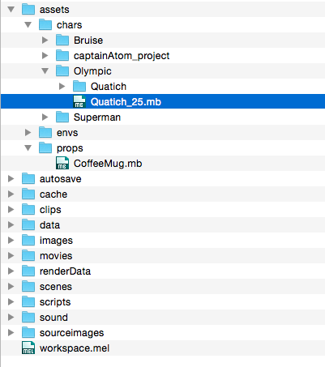

# shot-create
a tool created by Cameron Billingham

shot-create is a Maya project management tool written in python that provides a graphical user interface for adding character, environment, and prop assets while creating new shots and scenes.

## Purpose of the Tool
The purpose of shot-create is to provide a fast and easy way to add assets and automatically build maya files for new shots. The tool provides an easy way to visualize assets, providing previews based on rendered images or video files. It allows users to visualize the layout of scenes and shots and to add new shots or duplicate a shot to contain the same assets.

## Assumptions
The tool assumes a standard maya project directory structure that looks like figure 2 below (with chars, envs, and props directories under assets).



It also assumes that you are working with standard maya files (either .ma or .mb files).

To load previews, shot-create assumes that rendered image and video previews are within the same directory as the asset's maya file. (An additional future feature is searching the `[current_project]/images/` directory for matching preview media).

shot-create also requires the use of the mayapy interpreter. You must have the mayapy in this location /Applications/Autodesk/maya2016/Maya.app/Contents/bin/mayapy (currently working on how to support multiple versions of maya)

## How to Use It
Run shot-create using python 2.6:

```
python shot-create.py
```


1. First use the opening dialogue to load the maya project directory that you are working on
    * You can always change your project by opening a new one in the file menu
2. Create a new scene and title your shot
    * Pick a scene directory that you already added or make a new one
    * Add a shot title
3. Preview assets that are in your assets directory
    * Select assets that are stored in the chars, envs, or props directory
    * View the preview images or videos of those assets
    * Add and remove assets into your shot
4. Add some additional camera settings
5. Build your maya shot file with the build button

Additional Future Features (goal is to get these finished)
* the ability to duplicate a shot and rename it
* the ability to select whether you want to build the python file or export the script


## Technical Details
To organize your scenes and shots, shot-create uses the scenes directory and organizes the directory structure placing shot files inside scene folders. Python makes searching and add to the directory structure extremely easy.

Similarly to get assets from your assets file, shot-create crawls your assets directory for .mb and .ma files and their associated previews. This allows you to quickly see all of your assets for loading into shots.

To build the maya file, shot-create uses mayapy (the standalone maya interpreter) to open a maya project and load the assets into the file. It then saves the maya project into the scene directory.